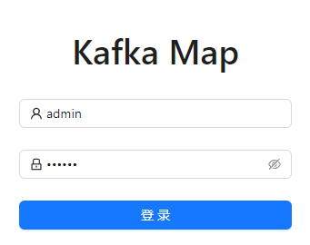
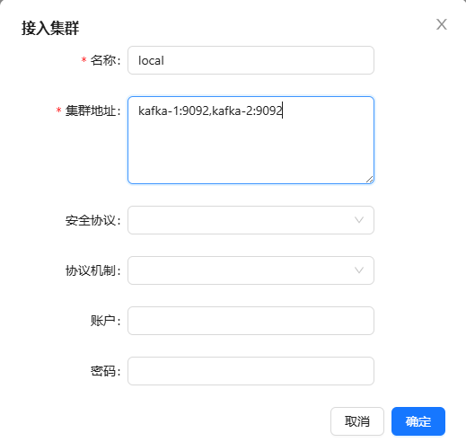

# Kafka -- ACL 认证版 -- 未完成版本...

### 运行

```shell
# 停止
docker-compose -f docker-compose.yml -p kafka down
# 启动
docker-compose -f docker-compose.yml -p kafka up -d
```

### kafka-map 可视化工具

https://github.com/dushixiang/kafka-map

- 访问：http://127.0.0.1:9006
- 账号密码：admin/123456



添加集群 eg: kafka-1:9092,kafka-2:9092



### java 客户端连接

```yml
spring:
  kafka:
    bootstrap-servers: 127.0.0.1:9094,127.0.0.1:9093 # 127.0.0.1:9092,127.0.0.1:9093,127.0.0.1:9094 # Kafka服务器的地址。集群用多个逗号分隔
    # 认证配置
    properties:
      security.protocol: SASL_PLAINTEXT
      sasl.mechanism: SCRAM-SHA-256
      sasl.jaas.config: org.apache.kafka.common.security.scram.ScramLoginModule required username="admin" password="admin-secret";
```

### 测试消费

> tips: 使用容器内部通信方式可不用用户认证，外部访问时需要认证。

```shell
# 1、创建主题(如果不存在)
docker exec -it kafka-1 /opt/bitnami/kafka/bin/kafka-topics.sh --bootstrap-server kafka-1:9092 --create --if-not-exists --topic topic1 --partitions 3 --replication-factor 2

# 2、为消费者组添加ACL权限（手动配置消费者组权限） -- 有了消费者组权限之后就可以订阅主题消息了...
docker exec -it kafka-1 /opt/bitnami/kafka/bin/kafka-acls.sh --bootstrap-server kafka-1:9092 --add --allow-principal User:test --operation Read --operation Describe --group group1

# 3、为主题添加生产和消费的ACL权限
# docker exec -it kafka-1 /opt/bitnami/kafka/bin/kafka-acls.sh --bootstrap-server kafka-1:9092 --add --allow-principal User:test --operation Write --operation Describe --operation Read --topic topic1

# 4、为集群内部通信添加权限（必须步骤，否则集群节点间通信会被拒绝）
docker exec -it kafka-1 /opt/bitnami/kafka/bin/kafka-acls.sh --bootstrap-server kafka-1:9092 --add --allow-principal User:ANONYMOUS --operation All --cluster

# 5、查看设置的ACL权限
docker exec -it kafka-1 /opt/bitnami/kafka/bin/kafka-acls.sh --bootstrap-server kafka-1:9092 --list

# 6、控制台生产者 -- 测试生产消息
# docker exec -it kafka-1 /opt/bitnami/kafka/bin/kafka-console-producer.sh --bootstrap-server kafka-1:9092 --topic topic1  # 容器内部通信方式可不用认证
docker exec -it kafka-1 /opt/bitnami/kafka/bin/kafka-console-producer.sh --bootstrap-server 192.168.101.2:9093 --topic topic1 --producer.config /opt/bitnami/kafka/config/producer-admin.properties

# 7、控制台消费者 -- 使用指定的消费者组消费消息
# docker exec -it kafka-1 /opt/bitnami/kafka/bin/kafka-console-consumer.sh --bootstrap-server kafka-1:9092 --topic topic1 --group group1 --from-beginning
# 测试不同账号的授权
docker exec -it kafka-1 /opt/bitnami/kafka/bin/kafka-console-consumer.sh --bootstrap-server 192.168.101.2:9093 --topic topic1 --group group1 --consumer.config /opt/bitnami/kafka/config/consumer-admin.properties
docker exec -it kafka-1 /opt/bitnami/kafka/bin/kafka-console-consumer.sh --bootstrap-server 192.168.101.2:9093 --topic topic1 --group group1 --consumer.config /opt/bitnami/kafka/config/consumer-test.properties

# 8、验证消费者组是否正确创建和工作 -- 会显示消费者组信息、分区分配和偏移量等详情。
# docker exec -it kafka-1 /opt/bitnami/kafka/bin/kafka-consumer-groups.sh --bootstrap-server kafka-1:9092 --describe --group group1

# 9、重置消费者组（如需测试，先停止消费者组）
# docker exec -it kafka-1 /opt/bitnami/kafka/bin/kafka-consumer-groups.sh --bootstrap-server kafka-1:9092 --group group1 --reset-offsets --to-earliest --execute --topic topic1
```
